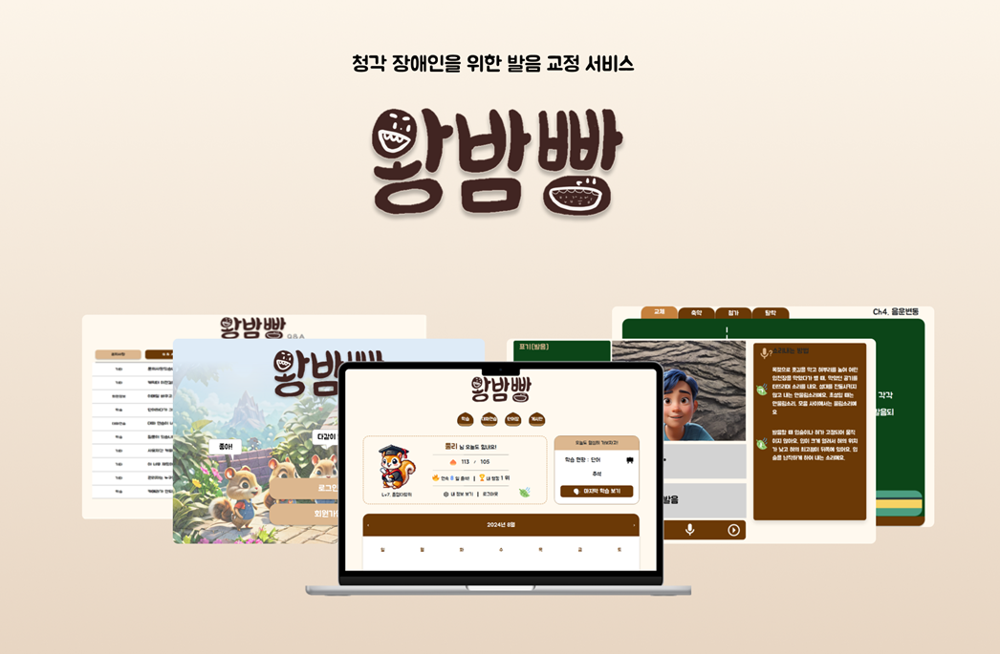
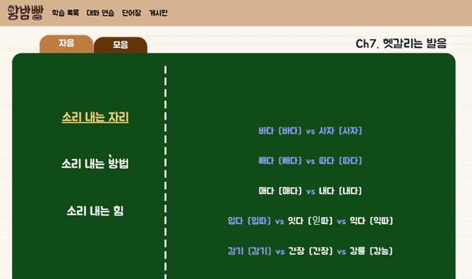
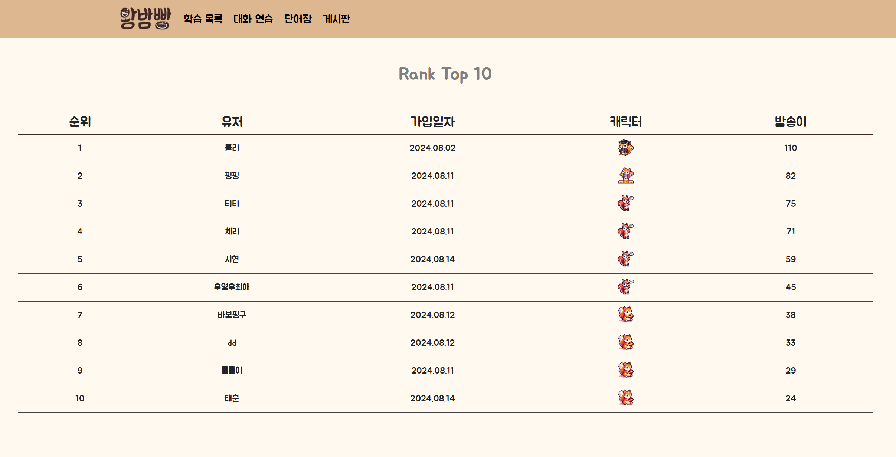
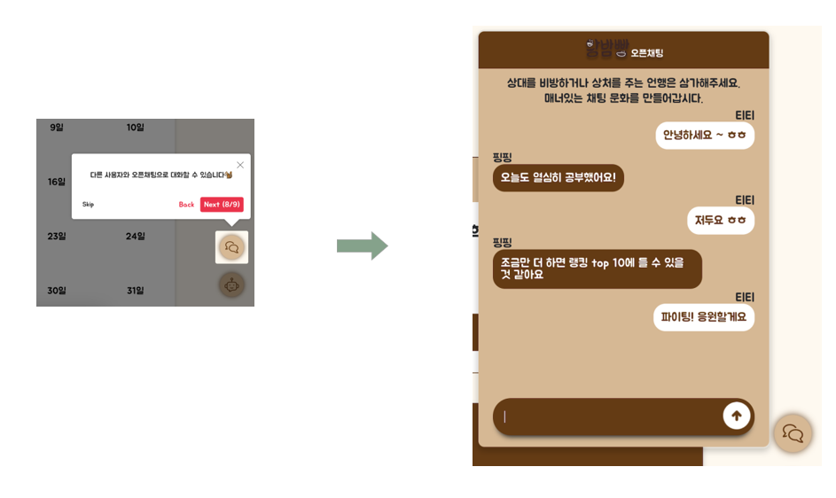
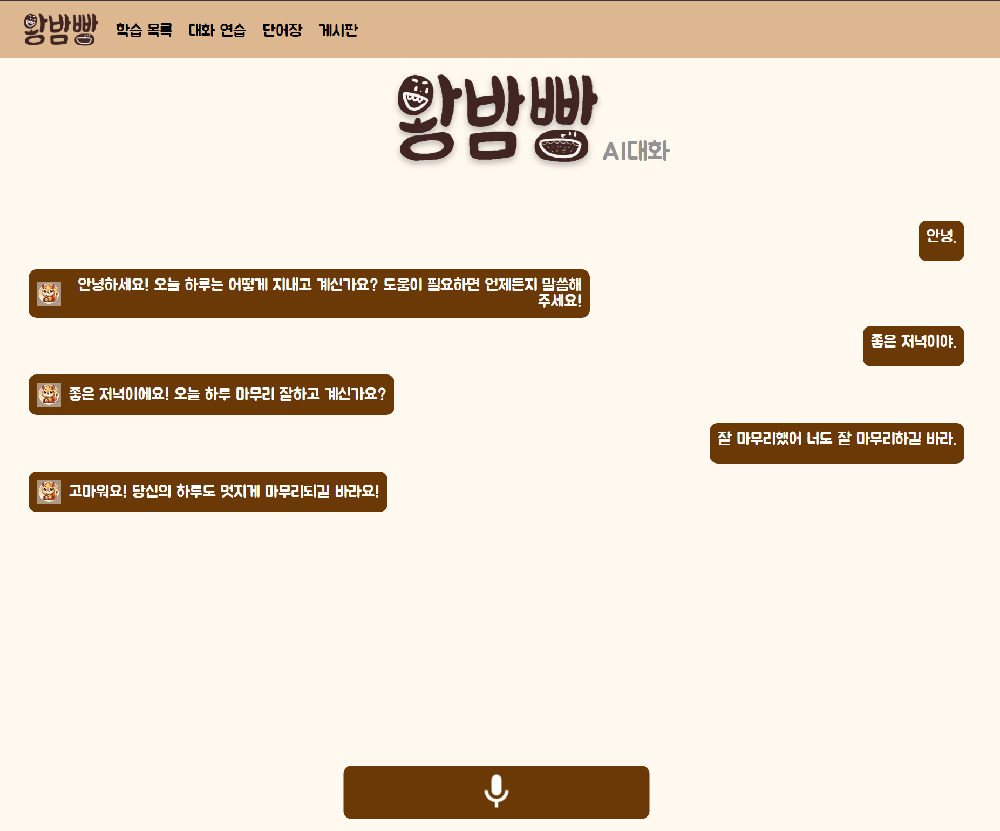
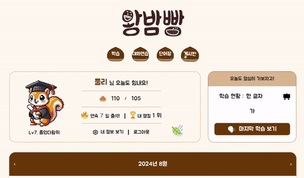
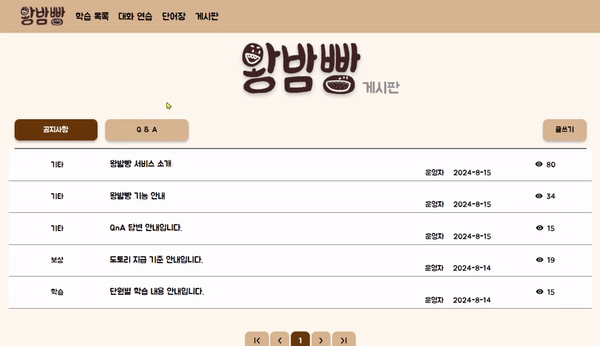
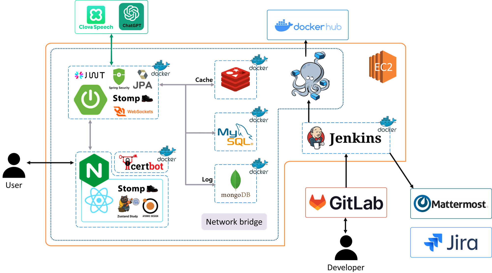
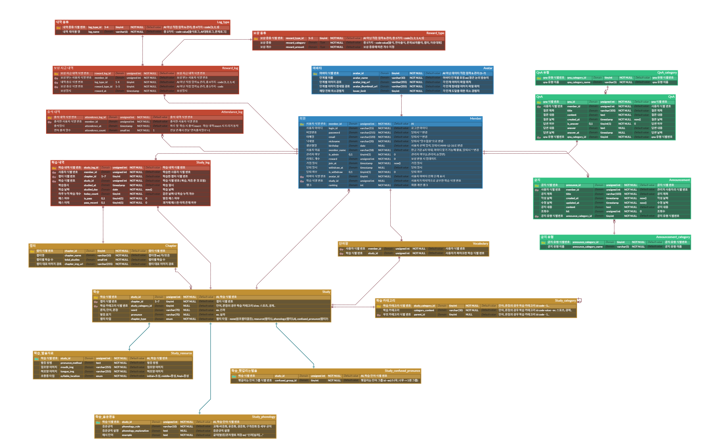
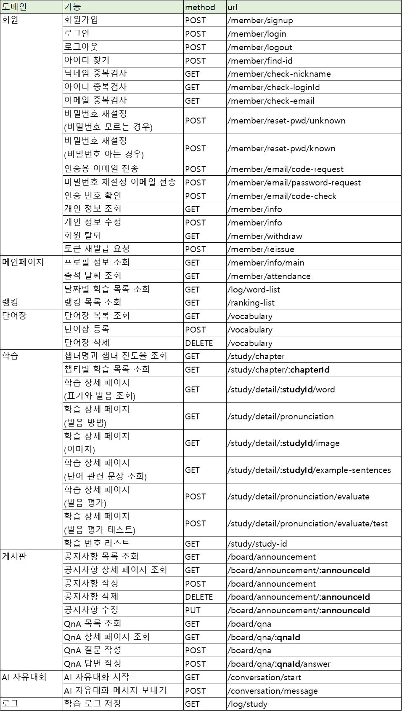

# **🌰**서비스명: 왕밤빵



## ✔프로젝트 소개


**진행 기간**
    
2024.07.02 ~ 2024.08.16 (6주)
    
**서비스 개요**
    
청각장애인을 위한 발음 학습 서비스입니다.
자모음부터 단어, 문장, 헷갈리는 발음 순서로 학습하며, 발음 평가 및 AI와의 자유 대화 기능을 통해 청각장애인의 구화를 돕습니다.
이를 통해 사용자들은 발음하는 방법을 익히고, 구화에 자신감을 얻을 수 있습니다.
    
**팀원**
|||||||
 |:-:|:-:|:-:|:-:|:-:|:-:|
 |[이지혜](https://github.com/Elenaljh)|[김아름](https://github.com/aa001R)|[김민진](https://github.com/codemj99)|[박은지](https://github.com/eunji04)|[김시현](https://github.com/kimsihyeon24)|[이재혁](https://github.com/Elenaljh)|
 |Backend Developer|Backend Developer|Frontend Developer|Backend Developer|Frontend Developer|Frontend Developer|
<details>
<summary>역할 상세</summary>
<div markdown="1">
<div class="team-member"> 
<h3>이지혜</h3>
<ul>
    <li>역할: 팀장, 백엔드 개발</li>
    <li>담당</li>
        <ul>
            <li>데이터 수집 및 DB에 저장</li>
            <li>백엔드 폴더 구조 결정 및 생성, 엔티티 클래스 작성</li>
            <li>학습 컨텐츠 조회 api, 학습 로그 저장 api, 단어장 api, 랭킹 api</li>
            <li>오픈채팅 백엔드, 프론트엔드 구현</li>
            <li>로그인, 회원정보 조회/수정, 게시판 프론트엔드 수정 및 구현</li>
        </ul>
</ul>
</div>
<div class="team-member"> 
<h3>김아름</h3>
<ul>
    <li>역할: 인프라 설계, 백엔드 개발</li>
    <li>담당</li>
        <ul>
            <li>데이터 수집</li>
            <li>CICD 파이프라인 설계 및 구축, Nginx 리버스 프록시 설정, Docker & Docker Compose를 활용한 컨테이너 관리</li>
            <li>발음 평가, 개인정보 및 출석 관리, 공지사항, AI 음성 채팅 API 설계 및 구현</li>
            <li>AI 음성 채팅 최적화: 프롬프트 작성 및 튜닝</li>
            <li>아이디 찾기, Navbar, Pagination, Chapter 1 학습 상세 페이지 CSS 및 JavaScript 개선</li>
        </ul>
</ul>
</div>
<div class="team-member"> 
<h3>김시현</h3>
<ul>
    <li>역할: 프론트 개발</li>
    <li>담당</li>
        <ul>
            <li>ai 자유대화 페이지 개발</li>
            <li>학습 상세페이지 개발</li>
            <li>게시판, qna 페이지 개발</li>
        </ul>
</ul>
</div>
<div class="team-member"> 
<h3>박은지</h3>
<ul>
    <li>역할: 백엔드 개발</li>
    <li>담당</li>
        <ul>
            <li>jwt 활용 회원 관리 로직 설계 및 구현</li>
            <li>QnA 게시판 API 설계 및 구현</li>
            <li>회원 가입, 비밀번호 찾기, 알림창 프론트엔드 수정 및 구현</li>
        </ul>
</ul>
</div>
<div class="team-member"> 
<h3>김민진</h3>
<ul>
    <li>역할: 프론트엔드 개발</li>
    <li>담당</li>
        <ul>
            <li>메인 페이지 개발</li>
            <li>학습 분류 페이지 개발</li>
            <li>단어장 페이지 개발</li>
            <li>서비스 튜토리얼 기능 개발</li>
        </ul>
</ul>
</div>
</div>
</details>
    

## ✔주요 기능


### 회원관리 및 로그인

로그인, 로그아웃, 회원정보 조회, 회원정보 수정, 인증/인가 등 기본적인 회원관리 기능을 구현했습니다.

<details>
<summary>화면 보기</summary>
<div markdown="1">
<p align="center"></p>
</div>
</details>

### 발음 학습 기능

자음/모음, 한 글자, 단어, 문장 순으로 단계별로 발음을 학습할 수 있습니다. 발음을 녹음해서 전송하면 채점 결과를 받을 수 있습니다. 웹캠 화면을 통해 본인의 입모양을 보면서 발음을 더 정확히 하는데 도움을 받을 수 있습니다.
    
<details>
<summary>화면 보기</summary>
<div markdown="1">
<p align="center"></p>
<p align="center"></p>
<p align="center"></p>
<p align="center"></p>
</div>
</details>

### 단어장 기능

복습하고 싶은 단어를 단어장에 저장해서 한번에 복습할 수 있습니다. 

<details>
<summary>화면 보기</summary>
<div markdown="1">
<p align="center"></p>
</div>
</details>
    

### 프로필 및 랭킹 조회

메인페이지에서 프로필(닉네임, 랭킹, 연속 출석 일수, 캐릭터 이미지)과 마지막으로 학습한 단어를 조회할 수 있습니다. 또한 캘린더를 통해 특정 일자에 얼마나 학습했는지 알 수 있고, 출석도장을 통해 언제 학습했는지 알 수 있습니다. 
랭킹페이지에서는 상위 10명의 프로필을 조회할 수 있습니다.

<details>
<summary>화면 보기</summary>
<div markdown="1">
<p align="center"></p>
<p align="center"></p>
<p align="center"></p>
<p align="center"></p>
</div>
</details>
    

### 오픈 채팅 기능

다른 유저들과 자유롭게 채팅을 할 수 있습니다.

<details>
<summary>화면 보기</summary>
<div markdown="1">
<p align="center"></p>
</div>
</details>
    

### AI 음성 채팅 기능

AI와의 음성 채팅을 통해 말로 하는 대화에 대한 자신감을 높일 수 있습니다.

<details>
<summary>화면 보기</summary>
<div markdown="1">
<p align="center"></p>
</div>
</details>
    

### 게시판 기능

공지사항과 QnA 게시판을 만들었습니다. 공지사항은 관리자만 작성 가능하고 모든 회원이 조회할 수 있습니다. QnA는 본인이 올린 질문만 볼 수 있으며 관리자만 답변을 달 수 있습니다.

<details>
<summary>화면 보기</summary>
<div markdown="1">
<p align="center"></p>
<p align="center"></p>
</div>
</details>
    

## ✔개발 구조


<p align="center"></p>

- **MySQL** : 서비스에 사용되는 전반적인 데이터 관리를 담당합니다
- **Redis** : 사용자 인증에 사용되는 refresh token을 저장하고, 그 외 랭킹 리스트, 닉네임 등 캐시 데이터를 저장합니다.
- **MongoDB** : 채팅 메시지를 저장합니다.

### 개발 환경
- 프론트엔드
    - 프로그래밍 언어 : JavaScript
    - 라이브러리 : React.js 18.3.1
- 백엔드
    - 프로그래밍 언어 : Java 17
    - 빌드 툴 : Gradle
    - 프레임워크 : Spring boot 3.3.2


### 기술 스택

**프레임워크 및 라이브러리**
<div>
  <span></span>
  <span></span>
  <span></span>
  <span></span>
  <span></span>
  <span></span>
  <span></span>
  <span></span>
</div>

**데이터베이스**
<div>
  <span></span>
  <span></span>
  <span></span>
</div>

**인프라 및 배포**

일정 기간동안만 배포했고, 현재는 배포되어있지 않은 상태입니다.
<div>
  <span></span>
  <span></span>
  <span></span>
  <span></span>
</div>

## ✔파일 구조

<table>
<tr>
<td width="50%" valign="top">
<div>
<p style="font-weight: bold">frontend</p>

```bash
chestnut/
├── public
└── src
    ├── api
    ├── assets
    │   └── lottie
    ├── atoms
    │   ├── Authentication
    │   │   └── MemberBirth
    │   ├── Board
    │   ├── ChapterList
    │   ├── Main
    │   └── SideButton
    ├── data
    ├── molecules
    │   ├── Authentication
    │   ├── Board
    │   ├── ChapterList
    │   ├── Main
    │   ├── Navbar
    │   ├── StudyList
    │   └── Vocabulary
    ├── organisms
    │   ├── Authentication
    │   ├── Board
    │   ├── ChapterList
    │   ├── Main
    │   ├── Navbar
    │   ├── SideButton
    │   ├── StudyList
    │   └── Vocabulary
    ├── pages
    ├── stores
    └── templates
        ├── Authentication
        ├── Board
        ├── ChapterList
        ├── Main
        └── StudyList
```
</div>
</td>
<td width="50%" valign="top">
<div>
<p style="font-weight: bold">backend</p>

```bash
chestnut/
├── announcement
│   ├── controller
│   ├── dto
│   ├── entity
│   ├── repository
│   └── service
├── avatar
│   ├── entity
│   └── repository
├── common
│   ├── config
│   ├── converter
│   ├── dto
│   ├── exception
│   ├── interceptor
│   ├── jwt
│   ├── service
│   └── validation
│       ├── annotation
│       └── validator
├── conversation
│   ├── controller
│   ├── dto
│   └── service
├── log
│   ├── controller
│   ├── dto
│   ├── entity
│   ├── repository
│   └── service
├── member
│   ├── controller
│   ├── dto
│   ├── entity
│   ├── repository
│   ├── service
│   └── validation
│       ├── annotation
│       └── validator
├── openchat
│   ├── controller
│   ├── dto
│   ├── repository
│   └── service
├── qna
│   ├── controller
│   ├── dto
│   ├── entity
│   ├── repository
│   └── service
├── study
│   ├── controller
│   ├── dto
│   ├── entity
│   ├── repository
│   ├── service
│   └── util
└── vocabulary
    ├── controller
    ├── dto
    ├── entity
    ├── repository
    └── service
```
</div>
</td>
</tr>
</table>


## ✔ERD


<p align="center"></p>

## ✔API 명세서

<p align="center"></p>
